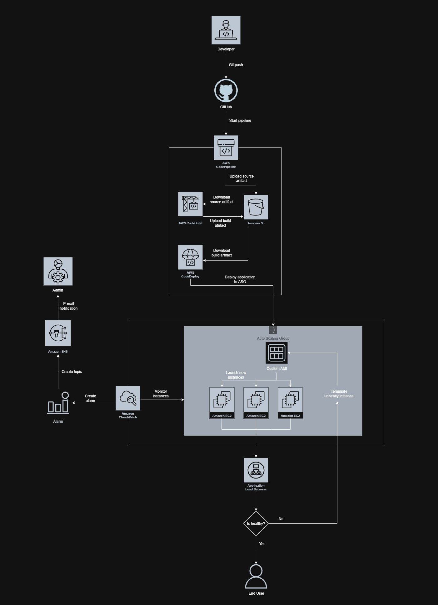

# **Flask Todo App – CI/CD on AWS**

## 1. Introduction

This project demonstrates a complete CI/CD pipeline on AWS for a sample Python Flask application.
The application is deployed on EC2 instances managed by an Auto Scaling Group (ASG), behind an Application Load Balancer (ALB). The deployment process is automated with AWS CodePipeline, CodeBuild, and CodeDeploy.

To ensure reliability and observability, the project integrates Amazon CloudWatch for monitoring (CPU usage, Nginx error logs) and Amazon SNS for alert notifications.

### 🎯 **Project Goals**

- Build a production-like DevOps pipeline using AWS services.

- Learn how to connect multiple AWS components into a working end-to-end deployment.

- Demonstrate scalability, monitoring, and alerting on a real web application.

### 🛠️ **Technologies Used**

- AWS: CodePipeline, CodeBuild, CodeDeploy, EC2, ASG, ALB, CloudWatch, SNS

- Python: Flask web application (REST API + HTML)

- Nginx: Reverse proxy (port 80 → 5000)

- GitHub: Source code repository

## **2. Architecture**

The project follows a cloud-native architecture with a focus on automation, scalability, and monitoring.  
A simple Flask Todo application is deployed on multiple EC2 instances inside an Auto Scaling Group (ASG), behind an Application Load Balancer (ALB). The entire process is orchestrated by a CI/CD pipeline built with AWS services.  

### **🔹 Key Components**
- **AWS CodePipeline** – orchestrates the CI/CD process (Source → Build → Deploy).  
- **AWS CodeBuild** – executes commands defined in **buildspec.yml**, runs unit tests (pytest), and produces the deployment artifact.  
- **AWS CodeDeploy** – handles deployment to EC2 instances using lifecycle hooks defined in **appspec.yml**.  
- **Amazon EC2 (Custom AMI)** – instances are launched from a custom AMI pre-installed with the AWS CodeDeploy Agent.This ensures that the deployment agent is always available without additional setup. Application code (Flask app + Nginx configuration) is deployed dynamically by CodeDeploy during the pipeline execution.  
- **Auto Scaling Group (ASG)** – ensures at least 2 running instances (desired = 2, minimum = 2, maximum = 3), distributes them across 3 Availability Zones (AZs) for high availability, and provides self-healing: if an instance or application becomes unhealthy, ASG automatically terminates and replaces it.  
- **Application Load Balancer (ALB)** – distributes incoming traffic across instances in multiple AZs, performs health checks, and ensures high availability.  
- **Amazon CloudWatch** – monitors system metrics (CPU) and log groups (Nginx access/error, Flask application logs).  
- **Amazon SNS** – delivers email alerts triggered by CloudWatch alarms.  

### **🔹 Deployment Flow**
1. Developer pushes code to **GitHub**.  
2. CodePipeline is triggered automatically.  
3. CodeBuild runs `buildspec.yml`, executes unit tests, and prepares the deployment package.  
4. CodeDeploy installs the new version on EC2 instances using lifecycle hooks (`BeforeInstall`, `AfterInstall`, `ApplicationStart`, `ValidateService`).  
5. ASG + ALB ensure high availability:  
   - Rolling deployment replaces instances gradually.  
   - Instances are spread across 3 AZs for fault tolerance.  
   - ASG runs minimum 2 and up to 3 instances, ensuring resilience and controlled scaling.  
   - ASG self-healing guarantees failed instances are replaced automatically.  
   - When a new instance is launched, it connects to the CodeDeploy Deployment Group and retrieves the latest deployed artifact from S3.  
     This ensures every new instance always runs the current application version without re-running the entire pipeline.  

6. CloudWatch + SNS provide monitoring and notifications.  

## **Architecture Diagram**

## **3. Pipeline (CI/CD)**

The CI/CD pipeline is implemented using AWS CodePipeline, which orchestrates the build, test, and deployment process.

- ### ** 🔹Repository**  
  Source code is stored in GitHub and integrated with CodePipeline.

- ### ** 🔹CodePipeline stages**
  - **Source**: Pulls the latest code from GitHub and stores it as a source artifact.
  - **Build**: CodeBuild runs according to `buildspec.yml` (install dependencies, run `pytest`, package the app).  
    The result is uploaded as a build artifact to S3.
  - **Deploy**: CodeDeploy fetches the artifact from S3 and deploys it to the EC2 instances in the ASG.

- ### ** 🔹CodeBuild**
  - Uses `buildspec.yml`.
  - Executes unit tests (pytest).
  - Produces the build artifact for CodeDeploy.

- ### ** 🔹 CodeDeploy**
  - Uses `appspec.yml` and lifecycle hooks (`stop → install → start → validate`).
  - Integrated with Auto Scaling Group (ASG) to ensure new and replaced instances are always provisioned with the latest app.
  - Supports automated rollback on deployment failure – if the validation script fails, the deployment is reverted to the previous healthy version.

## **4. Application**

The deployed application is a Flask Todo App running on Amazon EC2 instances inside an Auto Scaling Group.

### ** 🔹Flask Todo App**
  - Simple Flask-based web application with a Todo list.
  - Accessible via Application Load Balancer (ALB) hostname or public DNS.

### ** 🔹Nginx Reverse Proxy**
  - Nginx is configured as a reverse proxy.
  - Forwards external traffic from port 80 → 5000 (Flask app port).
  - Provides separation between web server (Nginx) and application server (Flask).

### ** 🔹CloudWatch Agent configuration**
  - Config file: `config/cw-config.json`
  - Collects logs and system metrics (CPU, memory, disk).
  - Integrated with CloudWatch Logs for monitoring Flask + Nginx.

 ### **🔹 Deployment Flow**
  - CodeDeploy installs and starts the Flask app on EC2 instances.
  -  Nginx proxies requests from ALB → Flask.
  - Health checks from ALB ensure only healthy instances receive traffic.

### **🔹 Project Structure**

- `app.py` — Flask application (main app logic)
- `appspec.yml` — CodeDeploy lifecycle configuration (stop / install / start / validate hooks)
- `buildspec.yml` — CodeBuild build & test steps (pytest, dependencies installation)
- `requirements.txt` — Python dependencies
- `test_app.py` — Unit tests for Flask app (pytest)

**Folders**
- `scripts/` — Deployment scripts for CodeDeploy
  - `install_dependencies.sh` — install Python dependencies  
  - `install_nginx.sh` — install and configure Nginx  
  - `configure_cw_agent.sh` — configure CloudWatch Agent  
  - `set_permissions.sh` — set correct file permissions  
  - `start_server.sh` — start Flask app  
  - `stop_server.sh` — stop Flask app  
  - `validate.sh` — health check (curl on app endpoint)  

- `nginx/` — Reverse proxy configuration  
  - `flask.conf` — Nginx config (redirect 80 → 5000, proxy_pass)  

- `config/` — CloudWatch Agent configuration  
  - `cw-config.json` — metrics and logs definition  

- `docs/` — Project documentations and diagrams 

 

## 5. Infrastructure

The infrastructure was designed with high availability, scalability, and self-healing in mind.  
It is based on EC2 instances managed by an Auto Scaling Group and exposed via an Application Load Balancer.

### 🔹 Amazon EC2
Instances are launched from a custom Amazon Linux 2023 AMI with the CodeDeploy agent pre-installed.  
This ensures that every new instance created by the ASG is deployment-ready.

### 🔹 Auto Scaling Group (ASG)
- Launch Template with custom AMI
- Desired capacity: 2
- Min: 2, Max: 4
- Instances are distributed across 3 Availability Zones
- Automatically replaces unhealthy instances (self-healing)

### 🔹 Application Load Balancer (ALB)
- Listens on port 80
- Performs health checks on target instances
- Routes traffic only to healthy instances inside the ASG

### 🔹 Security Groups
- ALB SG: allows inbound HTTP (80) from the internet  
- EC2 SG: allows only inbound traffic from ALB (port 5000 internal only)  
- Outbound access enabled for updates & dependencies

### 🔹 IAM Roles
- EC2 Instance Role: communication with CodeDeploy, CloudWatch, S3  
- CodeBuild & CodeDeploy Roles: permissions for artifact handling and deployments

## **6. Monitoring & Alerts**

Monitoring is handled by Amazon CloudWatch, which provides system metrics, application logs, and proactive alerting through alarms and SNS notifications.

### ** 🔹CloudWatch Metrics**
CloudWatch continuously collects metrics from EC2 instances and the application layer.  
This includes CPU utilization, memory and disk usage (via CloudWatch Agent), as well as application availability through ALB health checks.  

### ** 🔹CloudWatch Logs**
Both system and application logs are streamed to CloudWatch Logs:
- Nginx access and error logs (`/var/log/nginx/access.log`, `/var/log/nginx/error.log`)
- Flask application logs (`app.log`)  

These logs allow troubleshooting, performance monitoring, and error tracking in one central place.

### ** 🔹CloudWatch Alarms**
Alarms are configured to detect and respond to abnormal behavior.  
Examples include:
- CPU utilization exceeding 70%  
- Error entries in Nginx logs  
- Failed ALB health checks  

When triggered, alarms send notifications via Amazon SNS.

### ** 🔹SNS Notifications**
Amazon SNS ensures that administrators are informed in real time.  
Email subscribers receive alerts about high CPU load, application errors, or instance failures, enabling proactive responses to incidents.

### ** 🔹 Benefits**
With this setup, all metrics and logs are centralized in CloudWatch, while SNS provides instant awareness.  
Together with ASG self-healing, this ensures the system is both resilient and observable.