# **Flask Todo App – CI/CD on AWS**

## 1. Introduction 📖

This project demonstrates a complete CI/CD pipeline on AWS for a sample Python Flask application.
The application is deployed on EC2 instances managed by an Auto Scaling Group (ASG), behind an Application Load Balancer (ALB). The deployment process is automated with AWS CodePipeline, CodeBuild, and CodeDeploy.

To ensure reliability and observability, the project integrates Amazon CloudWatch for monitoring (CPU usage, Nginx error logs) and Amazon SNS for alert notifications.

### **Project Goals**

- Build a production-like DevOps pipeline using AWS services.

- Learn how to connect multiple AWS components into a working end-to-end deployment.

- Demonstrate scalability, monitoring, and alerting on a real web application.

### **Technologies Used**

- AWS: CodePipeline, CodeBuild, CodeDeploy, EC2, ASG, ALB, CloudWatch, SNS

- Python: Flask web application (REST API + HTML)

- Nginx: Reverse proxy (port 80 → 5000)

- GitHub: Source code repository

## 2. Architecture 🏗️

The project follows a cloud-native architecture with a focus on automation, scalability, and monitoring.  
A simple Flask Todo application is deployed on multiple EC2 instances inside an Auto Scaling Group (ASG), behind an Application Load Balancer (ALB). The entire process is orchestrated by a CI/CD pipeline built with AWS services.  

### **🔹 Key Components**
- **AWS CodePipeline** – orchestrates the CI/CD process (Source → Build → Deploy).  
- **AWS CodeBuild** – executes commands defined in **buildspec.yml**, runs unit tests (pytest), and produces the deployment artifact.  
- **AWS CodeDeploy** – handles deployment to EC2 instances using lifecycle hooks defined in **appspec.yml**.  
- **Amazon EC2 (Custom AMI)** – instances are launched from a custom AMI pre-installed with the AWS CodeDeploy Agent.This ensures that the deployment agent is always available without additional setup. Application code (Flask app + Nginx configuration) is deployed dynamically by CodeDeploy during the pipeline execution.  
- **Auto Scaling Group (ASG)** – ensures at least 2 running instances (desired = 2, minimum = 2, maximum = 3), distributes them across 3 Availability Zones (AZs) for high availability, and provides self-healing: if an instance or application becomes unhealthy, ASG automatically terminates and replaces it.  
- **Application Load Balancer (ALB)** – distributes incoming traffic across instances in multiple AZs, performs health checks, and ensures high availability.  
- **Amazon CloudWatch** – monitors system metrics (CPU) and log groups (Nginx access/error, Flask application logs).  
- **Amazon SNS** – delivers email alerts triggered by CloudWatch alarms.  

### 🔹 **Deployment Flow**
1. Developer pushes code to **GitHub**.  
2. **CodePipeline** is triggered automatically.  
3. **CodeBuild** runs tests and prepares the deployment package.  
4. **CodeDeploy** installs the new version on EC2 instances (lifecycle hooks).  
5. **ASG + ALB** ensure rolling updates, high availability, and self-healing.  
6. **CloudWatch + SNS** provide monitoring and notifications.  

## **Architecture Diagram**

## 3. Pipeline (CI/CD) 🔄 

The CI/CD pipeline is implemented using AWS CodePipeline, which orchestrates the build, test, and deployment process.

- ### **Repository**  
  Source code is stored in GitHub and integrated with CodePipeline.

- ### **CodePipeline stages**
  - **Source**: Pulls the latest code from GitHub and stores it as a source artifact.
  - **Build**: CodeBuild runs according to `buildspec.yml` (install dependencies, run `pytest`, package the app).  
    The result is uploaded as a build artifact to S3.
  - **Deploy**: CodeDeploy fetches the artifact from S3 and deploys it to the EC2 instances in the ASG.

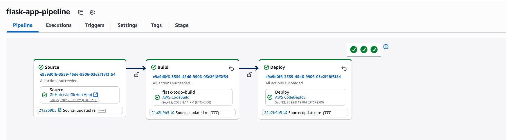

- ### **CodeBuild**
  - Uses `buildspec.yml`.
  - Executes unit tests (pytest).
  - Produces the build artifact for CodeDeploy.

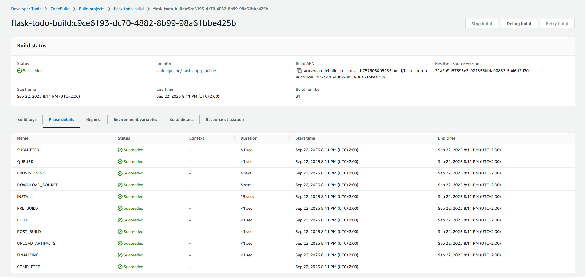  

- ### **CodeDeploy**
  - Uses `appspec.yml` and lifecycle hooks (`stop → install → start → validate`).
  - Integrated with Auto Scaling Group (ASG) to ensure new and replaced instances are always provisioned with the latest app.
  - Supports automated rollback on deployment failure – if the validation script fails, the deployment is reverted to the previous healthy version.

 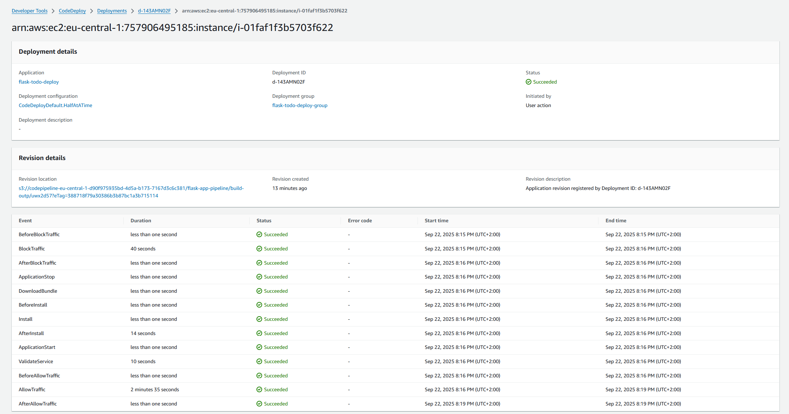   

## **4. Application 💻**

The deployed application is a Flask Todo App running on Amazon EC2 instances inside an Auto Scaling Group fronted by Application Load Balancer.

 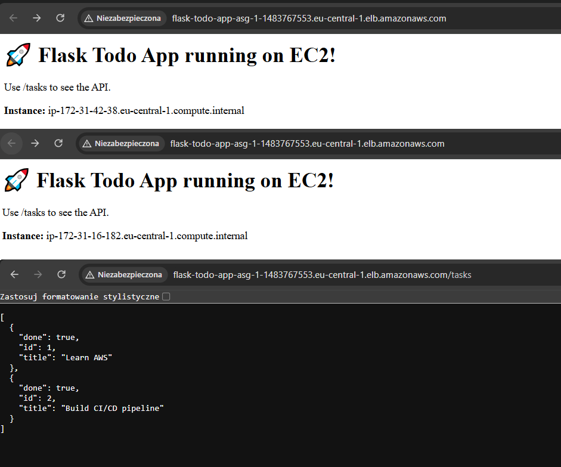  

### **Flask Todo App**
  - Simple Flask-based web application with a Todo list.
  - Accessible via Application Load Balancer (ALB) hostname or public DNS.

### **Nginx Reverse Proxy**
  - Nginx is configured as a reverse proxy.
  - Forwards external traffic from port 80 → 5000 (Flask app port).
  - Provides separation between web server (Nginx) and application server (Flask).

### **CloudWatch Agent configuration**
  - Config file: `config/cw-config.json`
  - Collects logs and system metrics (CPU, memory, disk).
  - Integrated with CloudWatch Logs for monitoring Flask + Nginx.

 ### **Deployment Flow**
  - CodeDeploy installs and starts the Flask app on EC2 instances.
  -  Nginx proxies requests from ALB → Flask.
  - Health checks from ALB ensure only healthy instances receive traffic.

### **Project Structure**

- `app.py` — Flask application (main app logic)
- `appspec.yml` — CodeDeploy lifecycle configuration (stop / install / start / validate hooks)
- `buildspec.yml` — CodeBuild build & test steps (pytest, dependencies installation)
- `requirements.txt` — Python dependencies
- `test_app.py` — Unit tests for Flask app (pytest)

**Folders**
- `scripts/` — Deployment scripts for CodeDeploy
  - `install_dependencies.sh` — install Python dependencies  
  - `install_nginx.sh` — install and configure Nginx  
  - `configure_cw_agent.sh` — configure CloudWatch Agent  
  - `set_permissions.sh` — set correct file permissions  
  - `start_server.sh` — start Flask app  
  - `stop_server.sh` — stop Flask app  
  - `validate.sh` — health check (curl on app endpoint)  

- `nginx/` — Reverse proxy configuration  
  - `flask.conf` — Nginx config (redirect 80 → 5000, proxy_pass)  

- `config/` — CloudWatch Agent configuration  
  - `cw-config.json` — metrics and logs definition  

- `docs/` — Project documentations and diagrams 

 

## 5. Infrastructure ☁️

The infrastructure was designed with high availability, scalability, and self-healing in mind.  
It is based on EC2 instances managed by an Auto Scaling Group and exposed via an Application Load Balancer.

###  Amazon EC2
Instances are launched from a custom Amazon Linux 2023 AMI with the CodeDeploy agent pre-installed.  
This ensures that every new instance created by the ASG is deployment-ready.

###  Auto Scaling Group (ASG)
- Launch Template with custom AMI
- Desired capacity: 2
- Min: 2, Max: 4
- Instances are distributed across 3 Availability Zones
- Automatically replaces unhealthy instances (self-healing)

### Application Load Balancer (ALB)
- Listens on port 80
- Performs health checks on target instances
- Routes traffic only to healthy instances inside the ASG

###  Security Groups
- ALB SG: allows inbound HTTP (80) from the internet  
- EC2 SG: allows only inbound traffic from ALB (port 5000 internal only)  
- Outbound access enabled for updates & dependencies

### IAM Roles
- EC2 Instance Role: communication with CodeDeploy, CloudWatch, S3  
- CodeBuild & CodeDeploy Roles: permissions for artifact handling and deployments

## **6. Monitoring & Alerts 📊**

Monitoring is handled by Amazon CloudWatch, which provides system metrics, application logs, and proactive alerting through alarms and SNS notifications.

### **CloudWatch Metrics**
CloudWatch continuously collects metrics from EC2 instances and the application layer.  
This includes CPU utilization, memory and disk usage (via CloudWatch Agent), as well as application availability through ALB health checks.  

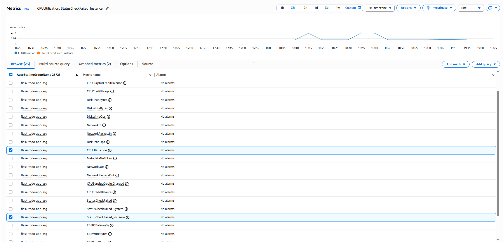

### **CloudWatch Logs**
Both system and deployment-related logs are streamed to CloudWatch Logs:
- Deployment logs (`/home/ec2-user/flask-todo-app/deploy.log`)
- Nginx access and error logs (`/var/log/nginx/access.log`, `/var/log/nginx/error.log`)
- CodeDeploy agent logs (`/var/log/aws/codedeploy-agent/codedeploy-agent.log`)

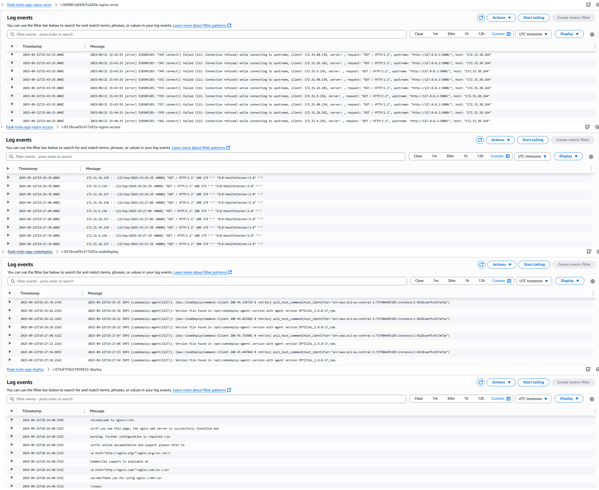

These logs provide visibility into deployments, web server activity, and potential application errors, all centralized in CloudWatch for easier troubleshooting and monitoring.

### **CloudWatch Alarms**
Alarms are configured to detect and respond to abnormal behavior.  
Examples include:
- CPU utilization exceeding 70%  
- Error entries in Nginx logs  
- Failed ALB health checks  

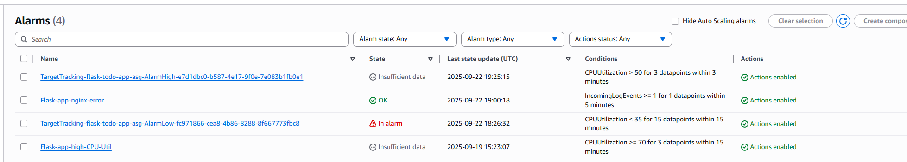

When triggered, alarm send notification via Amazon SNS.

### **SNS Notifications**
Amazon SNS ensures that administrators are informed in real time.  
Email subscribers might receive alerts about high CPU load, application errors, or instance failures, enabling proactive responses to incidents.

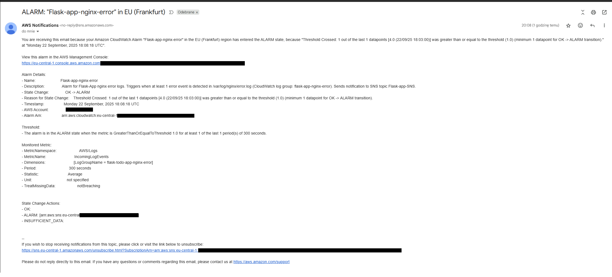

### **Benefits**
With this setup, all metrics and logs are centralized in CloudWatch, while SNS provides instant awareness.  
Together with ASG self-healing, this ensures the system is both resilient and observable.

## 7. Testing & Deployment 🧪

Deployment and testing are handled with a focus on stability and reliability.  
The system uses rolling updates, where only a portion of the instances is updated at a time. This ensures that even if something fails, part of the application remains available.

### Deployment Strategy
The Auto Scaling Group integrates with CodeDeploy to perform rolling deployments:
1. New version is first installed on a subset of instances (half-at-a-time).
2. Once validated, the update continues on the remaining instances.
3. In case of failure, CodeDeploy automatically triggers a rollback to the last known healthy version.

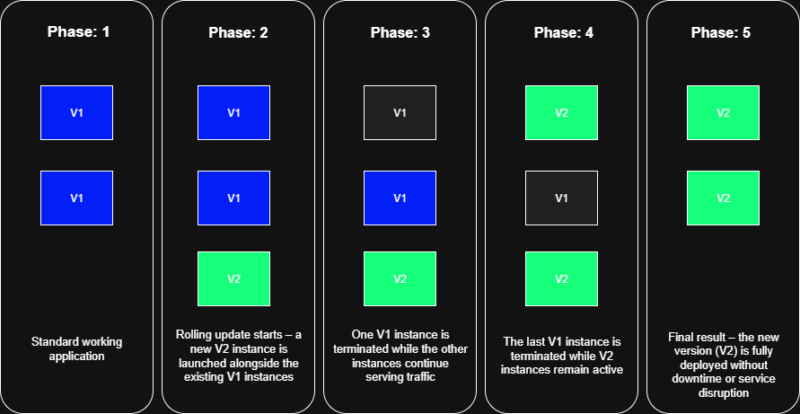

### Health Validation
Health checks are enforced at two levels:
1. CodeDeploy validation script (`validate.sh`) confirms the application is reachable on the instance.  
2. ALB health checks ensure that only healthy instances receive traffic from the load balancer.  

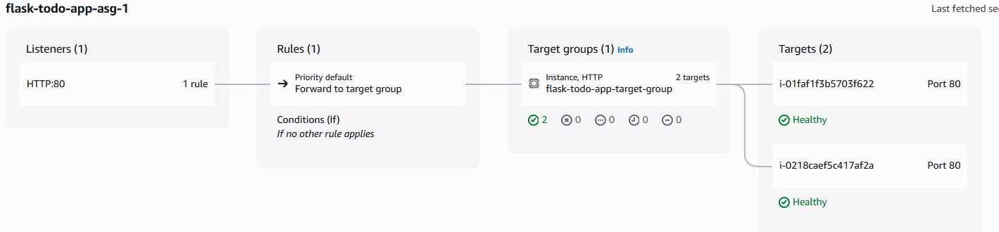

### Testing
Automated tests are included in the pipeline:
- CodeBuild executes unit tests (`pytest`) as part of the build process.  
- Validation script adds an extra safety net by simulating real user requests after deployment.  

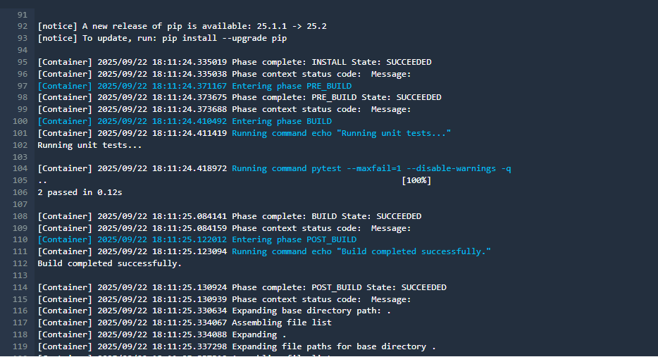

This dual approach (tests + health checks) guarantees that broken versions never go live and failed deployments are automatically reverted.

## 8. Costs & Optimization 💰

The project was designed with cost-efficiency in mind, while still demonstrating production-grade practices.  
AWS services used in this setup are mostly within the free or low-cost tier, making the project affordable for learning and portfolio purposes.

### Cost Drivers
- EC2 instances: running costs depend on instance type (t2.micro/t3.micro).  
- Auto Scaling Group: minimum of 2 instances ensures availability, but increases costs compared to a single EC2.  
- CloudWatch Logs & Metrics: small charges for log storage and custom metrics.  
- SNS: minimal cost per notification (negligible in small-scale setups).
- Application Load Balancer: generates the most costs even without using it, so it will only be active during application testing and documenting 

### Optimizations
1. Minimal instance size: smallest supported EC2 type for cost savings.  
2. On-demand usage: infrastructure runs only when needed; unused resources can be stopped/terminated.  
3. Free-tier eligible services: CloudWatch Alarms, SNS topics, and IAM are free at small scale.  
4. Scalable design: ASG scales up only when traffic requires it, preventing unnecessary expenses.

## 9. Lessons Learned 📚

This project was not only about building a working CI/CD pipeline, but also about understanding how AWS services integrate into a production-like environment.

### Evolution of the project

The application originally started as a **single EC2 instance** running Flask, deployed through a simplified pipeline (GitHub → CodePipeline → CodeDeploy, without CodeBuild).  
At this stage, monitoring was mostly manual. I experimented with health checks and basic auto-scaling using a combination of CloudWatch Alarms → SNS → Lambda (with boto3) to trigger scale actions.  

Eventually, I decided to move towards an Auto Scaling Group with an Application Load Balancer. This approach turned out to be a much better architectural choice because it provides not only scalability but also:  
- high availability by distributing traffic across multiple AZs,  
- built-in health checks and automatic replacement of unhealthy instances,  
- easier integration with CI/CD pipelines and rollback strategies.  

### What worked well
- The automated pipeline (CodePipeline → CodeBuild → CodeDeploy) ensured smooth deployments with rollback on failure.  
- Auto Scaling Group combined with ALB provided high availability and self-healing.  
- CloudWatch + SNS improved observability, giving real-time alerts for errors and high CPU usage.  

### Key takeaways
Working on this project highlighted the importance of designing for resilience from the very beginning, keeping the infrastructure modular so components can be replaced or scaled independently, and enabling monitoring early to simplify troubleshooting.  

### Next improvements
Future versions could include:  
- Infrastructure as Code (Terraform or CloudFormation).  
- HTTPS with ACM and Route 53 for custom domains.  
- Secret Manager for handling sensitive data.  
- Security scanning in the pipeline (Trivy, Gitleaks).  
- Containerization of the application with Docker, enabling easier packaging and portability.  
- Migration to Kubernetes for orchestration and advanced scaling instead of directly using EC2 instances.  

---
  
In summary, the project evolved from a single EC2 instance running Flask into a scalable, monitored, production-like system with CI/CD, ASG, ALB, and alerting.
